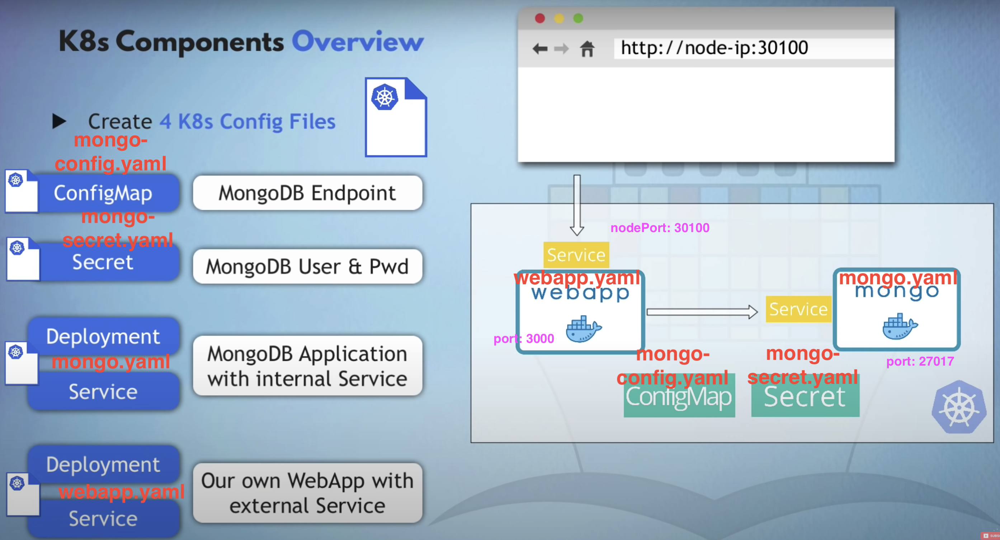
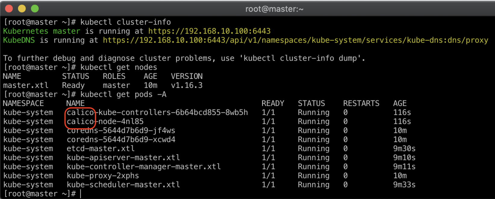

# k8s-demo 🐳


[](https://github.com/tquangdo/k8s-demo/issues/new)

## reference
- [youtube1](https://www.youtube.com/watch?v=dyaEzaDS7NQ)
- [youtube2](https://www.youtube.com/watch?v=CX8AnwTW2Zs)
- [youtube3](https://www.youtube.com/watch?v=hl6qFk6WhUk)
- [youtube4](https://www.youtube.com/watch?v=s_o8dwzRlu4)
- [xuanthulab](https://xuanthulab.net/gioi-thieu-va-cai-dat-kubernetes-cluster.html)
- [youtube5](https://www.youtube.com/watch?v=TMD_PhlLuPw)

## CLI
1. ### see info
    ```shell
    kubectl get all/namespace/node/svc/pod/replicaset/deployment/secret< (-A)--all-namespaces>< -o wide>
    kubectl get configmap
    kubectl config view
    kubectl config get-contexts
    #CURRENT   NAME             CLUSTER          AUTHINFO         NAMESPACE
    #*         docker-desktop   docker-desktop   docker-desktop
    # => kubectl config use-context docker-desktop
    kubectl version --output=yaml
    kubectl cluster-info
    ```
1. ### describe
    ```shell
    kubectl describe <svc/pod> node/docker-desktop
    ~~~~
    Name:               docker-desktop
    Roles:              control-plane
    Labels:             beta.kubernetes.io/arch=arm64
    ...
    Conditions:
    Type             Status  LastHeartbeatTime                 LastTransitionTime                Reason                       Message
    ----             ------  -----------------                 ------------------                ------                       -------
    MemoryPressure   False   Mon, 20 Feb 2023 11:14:33 +0900   Sun, 19 Feb 2023 22:13:12 +0900   KubeletHasSufficientMemory   kubelet has sufficient memory available
    ...
    Addresses:
    InternalIP:  192.168.65.4
    ...
    Allocatable:
    cpu:                4
    ...
    memory:             3925304Ki
    pods:               110
    ```
1. ### deployment
    ```shell
    kubectl create deployment [name]
    ```
1. ### debug
    ```shell
    kubectl logs [pod name]
    kubectl exec -it [pod name] -- bin/bash
    ```
1. ### config file
    ```shell
    kubectl apply -f [file name]
    kubectl delete -f [file name]
    kubectl delete --all svc/pod/replicaset/deployment/secret --namespace=default
    kubectl delete all --all -n {namespace}
    ```

## youtube1
1. ### get all
    ```shell
    kubectl get all      
    ~~~~
    # 1/ pod
    NAME                                READY   STATUS    RESTARTS   AGE
    pod/yt1-metadata-5f9dc4d6bc-5vbgs   1/1     Running   0          8m43s
    pod/yt1-metadata-5f9dc4d6bc-g8xqp   1/1     Running   0          8m43s
    pod/yt1-metadata-5f9dc4d6bc-q4hjn   1/1     Running   0          8m43s

    # 2/ service
    NAME                  TYPE           CLUSTER-IP     EXTERNAL-IP   PORT(S)          AGE
    service/kubernetes    ClusterIP      10.96.0.1      <none>        443/TCP          18h
    service/yt1-service   LoadBalancer   10.104.114.3   localhost     8083:31932/TCP   29s

    # 3/ deployment
    NAME                           READY   UP-TO-DATE   AVAILABLE   AGE
    deployment.apps/yt1-metadata   3/3     3            3           8m43s

    # 4/ replicaset
    NAME                                      DESIRED   CURRENT   READY   AGE
    replicaset.apps/yt1-metadata-5f9dc4d6bc   3         3         3       8m43s
    ```
1. ### ssh to nginx container (in pod)
    ```shell
    kubectl exec -it yt1-metadata-5f9dc4d6bc-5vbgs -- bin/bash
    root@yt1-metadata-5f9dc4d6bc-5vbgs:/ ls
    #bin  boot  dev  docker-entrypoint.d  docker-entrypoint.sh  etc  home  lib  media  mnt  opt  proc  root  run  sbin  srv  sys  tmp  usr  var
    ```
1. ### demo
    - access `localhost:8083`(in `yt1/service.yaml`) on browser will see HP of Nginx
    

## youtube2
- run `kubectl apply -f yt2/deployment.yaml`
1. ### ERR
    - show 🔴 & search KW `False` will see errors
    
1. ### OK > port forward
    - with extension, type `10001:80` will auto create this command:
    ```shell
    kubectl port-forward pods/hello-deployment-f694ff6c4-cm2qz 10001:80 -n default
    # Forwarding from 127.0.0.1:10001 -> 80
    # Forwarding from [::1]:10001 -> 80
    # Handling connection for 10001
    ```
    
1. ### demo
    - access `localhost:10001` on browser will see `gcr.io/google-samples/hello-app:2.0`
    

## youtube3
1. ### (yt3-1) create deployment
    1. #### create
        ```shell
        kubectl create deployment demo-nginx --image=nginx --replicas=1
        kubectl get deployment 
        # NAME         READY   UP-TO-DATE   AVAILABLE   AGE
        # demo-nginx   1/1     1            1           2m24s
        kubectl get svc        
        # NAME         TYPE        CLUSTER-IP   EXTERNAL-IP   PORT(S)   AGE
        # kubernetes   ClusterIP   10.96.0.1    <none>        443/TCP   36h
        ```
    1. #### expose deployment
        ```shell
        kubectl expose deployment demo-nginx --port=80
        kubectl get svc
        # NAME         TYPE        CLUSTER-IP    EXTERNAL-IP   PORT(S)   AGE
        # demo-nginx   ClusterIP   10.98.20.54   <none>        80/TCP    8s
        # kubernetes   ClusterIP   10.96.0.1     <none>        443/TCP   36h
        ```
    1. #### port forward
        ```shell
        kubectl port-forward service/demo-nginx 17000:80
        # Forwarding from 127.0.0.1:17000 -> 80
        # Forwarding from [::1]:17000 -> 80
        # Handling connection for 17000
        ```
        - access `localhost:17000` on browser will see HP of Nginx
1. ### (yt3-2) run
    1. #### run
        ```shell
        kubectl run test-nginx --image=nginx --port=80
        kubectl get pod -> `get deployment`: No resources found!!!    
        #NAME         READY   STATUS    RESTARTS   AGE
        #test-nginx   1/1     Running   0          43m
        ```
    1. #### port forward
        ```shell
        kubectl port-forward pod/test-nginx 17000:80
        #Forwarding from 127.0.0.1:17000 -> 80
        #Forwarding from [::1]:17000 -> 80
        #Handling connection for 17000
        ```
        - access `localhost:17000` on browser will see HP of Nginx

## youtube4

-


1. ### run 4 yaml files
    ```shell
    kubectl apply -f yt4/mongo-config.yaml
    kubectl apply -f yt4/mongo-secret.yaml
    kubectl apply -f yt4/mongo.yaml
    kubectl apply -f yt4/webapp.yaml
    ```
1. ### check result
    1. ### secret
        ```shell
        kubectl get secret
        #NAME           TYPE     DATA   AGE
        #mongo-secret   Opaque   2      3m37s
        ```
    1. ### configmap
        ```shell
        kubectl get configmap
        #NAME               DATA   AGE
        #mongo-config       1      4m
        ```
    1. ### service
        ```shell
        kubectl get svc                                   
        #NAME             TYPE        CLUSTER-IP     EXTERNAL-IP   PORT(S)          AGE
        #kubernetes       ClusterIP   10.96.0.1      <none>        443/TCP          39m
        #mongo-service    ClusterIP   10.111.82.5    <none>        27017/TCP        4m57s
        #webapp-service   NodePort    10.101.60.17   <none>        3000:30100/TCP   4m48s
        ```
    1. ### pod
        ```shell
        kubectl get pod      
        #NAME                                 READY   STATUS    RESTARTS   AGE
        #mongo-deployment-7d4d5c9f6c-9mzhh    1/1     Running   0          3m47s
        #webapp-deployment-649d7fb885-xw6mq   1/1     Running   0          3m38s
        kubectl logs webapp-deployment-649d7fb885-xw6mq -f
        #app listening on port 3000!
        ```
1. ### access on browser

-


## xuanthulab


1. ### install in 1 master & 2 workers
    - define file `install-docker-kube.sh`
    ```shell
    ...
    yum install -y -q kubeadm kubelet kubectl
    systemctl enable kubelet
    systemctl start kubelet
    ...
    # Configure NetworkManager before attempting to use Calico networking.
    cat >>/etc/NetworkManager/conf.d/calico.conf<<EOF
    ```
    - call sh in `master` vagrant file
    ```shell
    # Chạy file install-docker-kube.sh sau khi nạp Box
    config.vm.provision "shell", path: "./../install-docker-kube.sh"
    ```
    - call sh in `worker` vagrant file
    ```shell
    config.vm.provision "shell", path: "./../install-docker-kube.sh"
    config.vm.provision "shell", inline: <<-SHELL
    ```
1. ### Khởi tạo Cluster
    - Trong lệnh khởi tạo cluster có tham số --pod-network-cidr để chọn cấu hình mạng của POD, do dự định dùng Addon calico nên chọn --pod-network-cidr=192.168.0.0/16
    - Gõ lệnh sau để khở tạo là nút master của Cluster
    ```shell
    kubeadm init --apiserver-advertise-address=172.16.10.100 --pod-network-cidr=192.168.0.0/16
    ```
1. ### calico
    1. #### create
        - Tiếp đó, nó yêu cầu cài đặt một Plugin mạng trong các Plugin tại addon, ở đây đã chọn calico, nên chạy lệnh sau để cài nó
        ```shell
        kubectl apply -f https://docs.projectcalico.org/v3.10/manifests/calico.yaml
        ```
    1. #### check
        - `kubectl get pods -A`
        
1. ### Kết nối Node vào Cluster
    - `kubeadm token create --print-join-command`
    

## youtube5


1. ### Build Docker Images
    ```shell
    yt5$ docker build -t amilinko/client-example:v10 -f ./client/Dockerfile ./client
    yt5$ docker build -t amilinko/server-example:v10 -f ./server/Dockerfile ./server
    ```
1. ### minikube
    1. #### install
        - `brew install minikube`
    1. #### cmd
        - start
        ```shell
        minikube version  
        #minikube version: v1.29.0
        minikube start<delete>
        #Done! kubectl is now configured to use "minikube" cluster and "default" namespace by default
        ```
        - check
        ```shell
        kubectl get node -o wide
        #NAME       STATUS   ROLES           AGE   VERSION   INTERNAL-IP    EXTERNAL-IP   OS-IMAGE             KERNEL-VERSION     CONTAINER-RUNTIME
        #minikube   Ready    control-plane   11h   v1.26.1   192.168.49.2   <none>        Ubuntu 20.04.5 LTS   5.15.49-linuxkit   docker://20.10.23
        minikube profile list
        #|----------|-----------|---------|--------------|------|---------|---------|-------|--------|
        #| Profile  | VM Driver | Runtime |      IP      | Port | Version | Status  | Nodes | Active |
        #|----------|-----------|---------|--------------|------|---------|---------|-------|--------|
        #| minikube | docker    | docker  | 192.168.49.2 | 8443 | v1.26.1 | Running |     1 | *      |
        #|----------|-----------|---------|--------------|------|---------|---------|-------|--------|
        minikube status
        #type: Control Plane
        #host: Running
        #kubelet: Running
        #apiserver: Running
        #kubeconfig: Configured
        minikube ip
        #192.168.49.2
        ```
1. ### run youtube5
    ```shell
    kubectl apply -f yt5/k8s
    kubectl get all
    #NAME                                     READY   STATUS    RESTARTS   AGE
    #pod/client-deployment-695f658c48-bm5dl   1/1     Running   0          7m47s
    #pod/server-deployment-6fcdfddfd9-ddjwp   1/1     Running   0          7m47s

    #NAME                                TYPE        CLUSTER-IP      EXTERNAL-IP   PORT(S)          AGE
    #service/client-cluster-ip-service   NodePort    10.101.88.254   <none>        3000:31515/TCP   7m47s
    #service/kubernetes                  ClusterIP   10.96.0.1       <none>        443/TCP          27m
    #service/server-cluster-ip-service   NodePort    10.100.8.142    <none>        5000:31516/TCP   7m47s

    #NAME                                READY   UP-TO-DATE   AVAILABLE   AGE
    #deployment.apps/client-deployment   1/1     1            1           7m47s
    #deployment.apps/server-deployment   1/1     1            1           7m47s

    #NAME                                           DESIRED   CURRENT   READY   AGE
    #replicaset.apps/client-deployment-695f658c48   1         1         1       7m47s
    #replicaset.apps/server-deployment-6fcdfddfd9   1         1         1       7m47s
    ```
1. ### check minikube result
    1. #### opt1
        - run this cmd will auto access `http://127.0.0.1:51075` on browser
        ```shell
        minikube service client-cluster-ip-service
        #|-----------|---------------------------|-------------|---------------------------|
        #| NAMESPACE |           NAME            | TARGET PORT |            URL            |
        #|-----------|---------------------------|-------------|---------------------------|
        #| default   | client-cluster-ip-service |        3000 | http://192.168.49.2:31515 |
        #|-----------|---------------------------|-------------|---------------------------|
        #🏃  Starting tunnel for service client-cluster-ip-service.
        #|-----------|---------------------------|-------------|------------------------|
        #| NAMESPACE |           NAME            | TARGET PORT |          URL           |
        #|-----------|---------------------------|-------------|------------------------|
        #| default   | client-cluster-ip-service |             | http://127.0.0.1:51075 |
        #|-----------|---------------------------|-------------|------------------------|
        ```
        - result is the same with case run `http://localhost:31515` by docker desktop
        
        - access `http://192.168.49.2:31515` on browser -> can NOT show JSON response!!! In case run `http://localhost:31516/api/data` by docker desktop, not minikube is OK
        
    1. #### opt2
        - run this cmd & access `http://127.0.0.1:52242` on browser
        ```shell
        minikube service client-cluster-ip-service --url
        #http://127.0.0.1:52242
        #❗  Because you are using a Docker driver on darwin, the terminal needs to be open to run it.
        ```
    1. #### opt3
        ```shell
        kubectl port-forward svc/client-cluster-ip-service 3000:3000
        kubectl port-forward pod/client-deployment-xxx 3000:3000
        ```
    1. #### check log pod
        ```shell
        kubectl logs pod/server-deployment-xxx -f
        #Listening on Port 5000
        ```
    1. #### minikube dashboard
        ```shell
        minikube dashboard
        #🔌  Enabling dashboard ...
        ```

## dashboard & token

1. ### dashboard
    ```shell
    kubectl apply -f https://raw.githubusercontent.com/kubernetes/dashboard/v1.10.1/src/deploy/recommended/kubernetes-dashboard.yaml
    #secret/kubernetes-dashboard-certs created
    #serviceaccount/kubernetes-dashboard created
    kubectl -n kube-system get secret
    #NAME                              TYPE     DATA   AGE
    #kubernetes-dashboard-certs        Opaque   0      20m
    #kubernetes-dashboard-key-holder   Opaque   2      19m
    ```
1. ### proxy
    ```shell
    kubectl proxy
    ```
    - access on browser: `localhost:8001` or `http://localhost:8001/api/v1/namespaces/kube-system/services/https:kubernetes-dashboard:/proxy/`
    
1. ### config
    ```shell
    kubectl -n kube-system edit service kubernetes-dashboard
    ```
    - change from `type: ClusterIP` to `type: NodePort`
    ```shell
    kubectl -n kube-system get service kubernetes-dashboard
    #NAME                   TYPE       CLUSTER-IP     EXTERNAL-IP   PORT(S)         #AGE
    #kubernetes-dashboard   NodePort   10.100.31.29   <none>        443:30728/TCP   #3h5m
    ```
1. ### token
    - get token
    ```shell
    kubectl -n kube-system describe secret kubernetes-dashboard-key-holder
    #Name:         kubernetes-dashboard-key-holder
    #Type:  Opaque
    #Data
    #====
    #priv:  1675 bytes
    #pub:   459 bytes

    kubectl -n kube-system get secret kubernetes-dashboard-key-holder -oyaml             
    #apiVersion: v1
    #data:
    #  priv: xxx
    #  pub: yyy
    #kind: Secret
    #...
    ```
    - copy token in `get secret` result (now has NO token) and paste into token item of browser `https://localhost:30728`
    